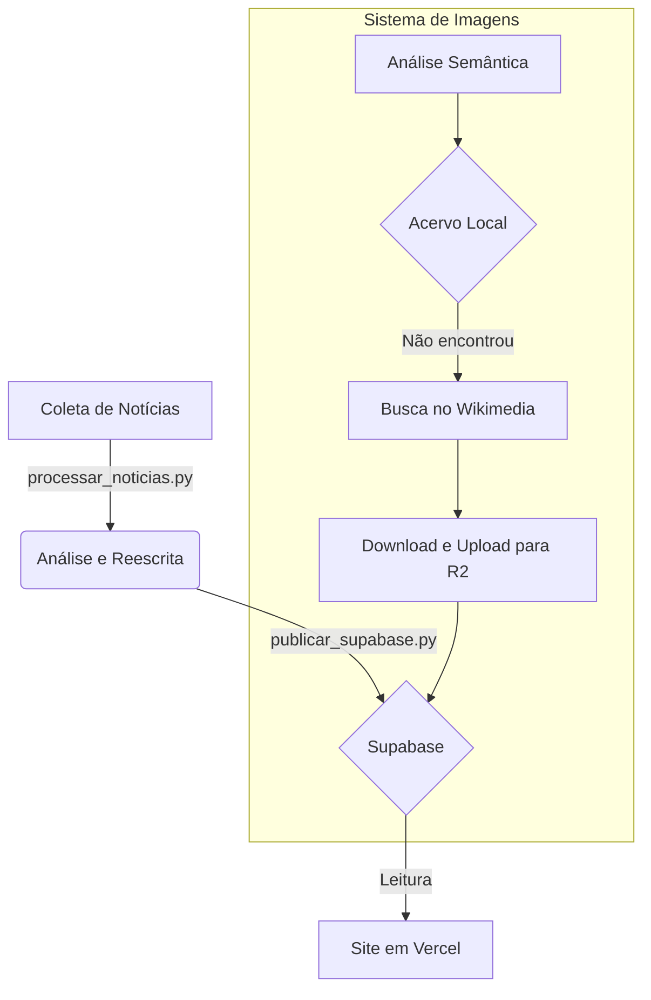

# Briefing do Desenvolvedor Backend - Axia News

**Data:** 29/12/2025  
**Versão:** 1.0  
**Autor:** Agente Desenvolvedor Backend

---

## 1. Visão Geral do Papel

### Missão

Sua missão como **Desenvolvedor Backend** é garantir a **saúde, performance e escalabilidade** de toda a infraestrutura de dados e automação do projeto Axia News. Você é o guardião da fundação técnica sobre a qual todo o ecossistema opera.

### Relação com o Agente Diretor

Você responde diretamente ao **Agente Diretor**, que define as prioridades estratégicas e delega as tarefas técnicas. Seu papel é traduzir as necessidades estratégicas em soluções de backend robustas, seguras e eficientes.

### Escopo de Responsabilidades

| Área | Descrição |
|:---|:---|
| **Scripts Python** | Manutenção e evolução de todos os scripts na pasta `/scraper/` |
| **Banco de Dados Supabase** | Integridade, performance (índices, RLS) e otimização das tabelas |
| **Armazenamento de Imagens (R2)** | Gestão do bucket, upload de imagens e URLs públicas |
| **Repositório GitHub** | Organização, limpeza e documentação técnica |

---

## 2. Arquitetura do Sistema

O sistema é composto por 4 componentes principais que trabalham em conjunto:

| Componente | Tecnologia | Propósito |
|:---|:---|:---|
| **Repositório Central** | GitHub | Armazena todo o código, documentação e acervo de imagens |
| **Banco de Dados** | Supabase (PostgreSQL) | Armazena todas as notícias publicadas |
| **Armazenamento de Imagens** | Cloudflare R2 | Hospeda todas as imagens em alta resolução |
| **Frontend** | Vercel | Exibe o site para o usuário final, lendo dados do Supabase |

### Fluxo de Dados



---

## 3. Estrutura do Repositório

| Diretório | Propósito |
|:---|:---|
| `/scraper/` | Contém os **scripts Python essenciais** para o ciclo de notícias |
| `/acervo_temas/` | Banco de imagens locais em HD, organizadas por categoria |
| `/documentacao/` | Documentação oficial do projeto (fluxos, guias, planos) |
| `/site/` | Código-fonte do frontend em React/TailwindCSS |
| `/_quarentena/` | Arquivos obsoletos ou de uso único, para exclusão futura |

---

## 4. Scripts Python Essenciais

| Script | Caminho | Propósito e Funcionamento |
|:---|:---|:---|
| `processar_noticias.py` | `scraper/processar_noticias.py` | **Orquestrador da coleta e processamento.** Chama módulos internos para coletar notícias dos 4 portais, analisar viés, gerar versões imparciais e aplicar deduplicação. |
| `publicar_supabase.py` | `scraper/publicar_supabase.py` | **Orquestrador da publicação.** Lê as notícias processadas, chama o sistema de imagens, faz upload para o R2 e publica no Supabase. |
| `deduplicacao.py` | `scraper/deduplicacao.py` | **Módulo de deduplicação.** Integrado ao `processar_noticias.py`, evita a publicação de notícias duplicadas. |
| `similaridade.py` | `scraper/similaridade.py` | **Módulo de similaridade.** Usado pelo `deduplicacao.py` para calcular a similaridade entre notícias. |
| `analisador_contexto.py` | `scraper/analisador_contexto.py` | **Análise semântica.** Analisa o título da notícia para determinar o contexto visual mais apropriado. |
| `buscador_imagens_br.py` | `scraper/buscador_imagens_br.py` | **Busca de imagens.** Busca imagens no Wikimedia Commons quando não há imagem adequada no acervo. |

---

## 5. Banco de Dados Supabase

- **Tabela Principal:** `articles`
- **Acesso:** Via SQL Editor no painel do Supabase ou programaticamente com a biblioteca `supabase-py`
- **Segurança:** Row Level Security (RLS) habilitado para permitir leitura pública e escrita apenas pelo backend

---

## 6. Armazenamento de Imagens (Cloudflare R2)

- **Upload:** Feito automaticamente pelo `publicar_supabase.py` usando a biblioteca `boto3`
- **Bucket:** `axia-news-imagens`
- **URL Pública:** `https://pub-3140440bf76b4ff189659bf15abaa214.r2.dev/<nome_do_arquivo>`

---

## 7. Sistema de Imagens Inteligente

O sistema opera em duas camadas para garantir a melhor imagem possível:

**Camada 1 - Análise Semântica (`analisador_contexto.py`):**
- Analisa o título e classifica o contexto em **Conceito/Símbolo**, **Instituição** ou **Pessoa**

**Camada 2 - Busca Automática (`buscador_imagens_br.py`):**
- Se não houver imagem no acervo, busca no Wikimedia Commons com base nas palavras-chave da análise semântica
- Valida as premissas obrigatórias:
  - **Resolução Mínima:** 1280px de largura
  - **Licença:** Creative Commons ou Domínio Público
  - **Sem Marca d'Água**

---

## 8. Configuração do Ambiente

### Arquivo .env

Crie um arquivo `.env` na raiz do projeto com a seguinte estrutura:

```
# Credenciais Supabase
SUPABASE_URL=***OCULTO***
SUPABASE_SERVICE_KEY=***OCULTO***

# Credenciais Cloudflare R2
R2_ACCOUNT_ID=***OCULTO***
R2_ACCESS_KEY_ID=***OCULTO***
R2_SECRET_ACCESS_KEY=***OCULTO***
R2_BUCKET_NAME=***OCULTO***
R2_PUBLIC_URL=***OCULTO***
R2_ENDPOINT=***OCULTO***
```

### Dependências Python

```bash
pip install python-dotenv supabase boto3 requests openai
```

---

## 9. Lições Aprendidas e Armadilhas

- **NÃO usar APIs genéricas de imagens (Unsplash, Pexels):** Retornam imagens sem contexto brasileiro.
- **NÃO confiar em scripts obsoletos:** Sempre verificar a documentação para o fluxo atual.
- **SEMPRE validar o `.env`:** A ausência de credenciais é a causa mais comum de falhas.
- **CUIDADO com a resolução das imagens:** Imagens de baixa qualidade comprometem a aparência profissional do site.

---

## 10. Manutenção e Boas Práticas

- **Adicionar novas imagens:** Adicione a imagem na pasta da categoria correspondente em `/acervo_temas/`.
- **Adicionar novas pessoas:** Atualize o mapeamento no `analisador_contexto.py`.
- **Expandir fontes de notícias:** Requer modificação no `processar_noticias.py`.
- **Commits:** Use mensagens claras e descritivas, seguindo o padrão `tipo: descrição` (ex: `feat: adiciona busca de imagens`, `fix: corrige erro de credencial`).
